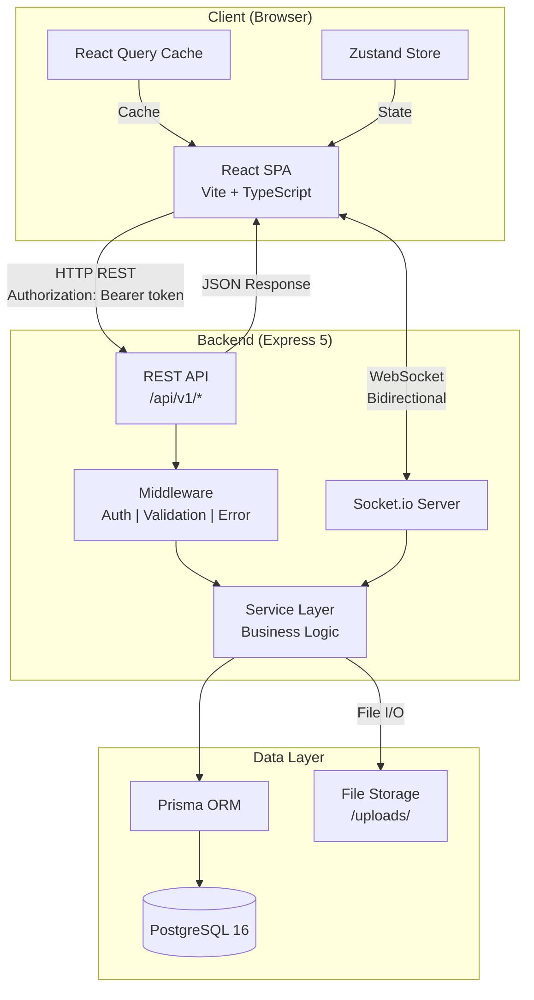
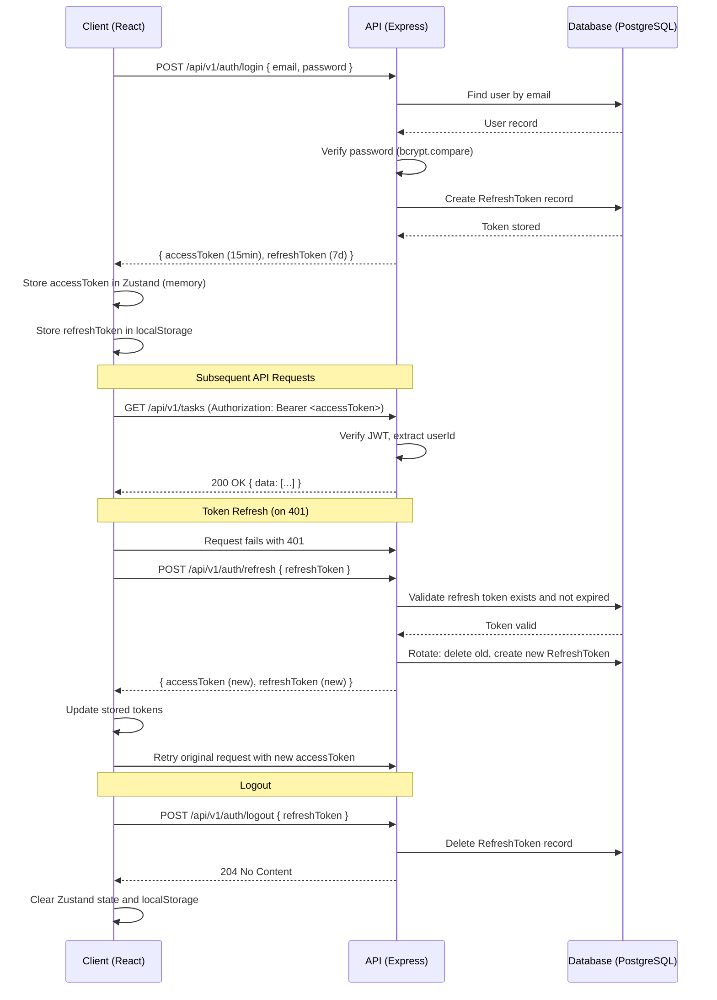
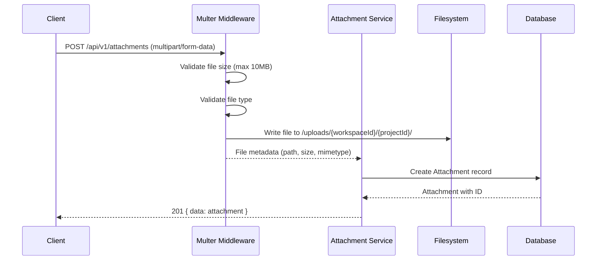

# HiveTech Architecture

## System Overview

HiveTech is a full-stack project management tool designed for engineering teams. It provides functionality similar to Linear and Jira, enabling teams to organize work across workspaces and projects with real-time collaboration.

### Core Capabilities

- **Workspaces** -- Multi-tenant isolation for organizations
- **Projects** -- Organize work within a workspace, each with custom statuses
- **Tasks** -- Rich task management with subtasks, dependencies, labels, comments, and file attachments
- **Real-Time Collaboration** -- Live updates via WebSockets so team members see changes instantly
- **Role-Based Access Control** -- Granular permissions at both workspace and project levels
- **Activity Tracking** -- Full audit trail of changes with JSON metadata

---

## Tech Stack

| Layer | Technology | Version |
|-------|-----------|---------|
| Frontend | React, Vite, TypeScript, TailwindCSS, Zustand, React Query, React Router | React 18, Vite 6, TS 5.7 |
| Backend | Express, TypeScript, Node.js, Socket.io, Pino logger | Express 5, Node 20 |
| Database | PostgreSQL, Prisma ORM | PostgreSQL 16, Prisma 6 |
| Auth | JWT (access + refresh tokens), bcryptjs | jsonwebtoken 9 |
| File Storage | Local filesystem (S3-ready architecture), Multer | Multer 1.4 |
| Validation | Zod | Zod 3.23 |
| Containerization | Docker, Docker Compose | Compose v3.8 |

### Frontend Libraries

| Library | Purpose |
|---------|---------|
| `@tanstack/react-query` | Server state management, caching, and synchronization |
| `zustand` | Client state management (auth, UI state) |
| `react-router-dom` | Client-side routing |
| `axios` | HTTP client with interceptors for auth |
| `socket.io-client` | Real-time WebSocket communication |
| `lucide-react` | Icon library |
| `clsx` + `tailwind-merge` | Conditional and merged CSS class utilities |
| `date-fns` | Date formatting and manipulation |

### Backend Libraries

| Library | Purpose |
|---------|---------|
| `express` | HTTP server and routing framework |
| `@prisma/client` | Type-safe database ORM |
| `socket.io` | WebSocket server for real-time features |
| `jsonwebtoken` | JWT creation and verification |
| `bcryptjs` | Password hashing |
| `multer` | Multipart file upload handling |
| `pino` | Structured JSON logging |
| `zod` | Runtime schema validation |
| `helmet` | HTTP security headers |
| `cors` | Cross-origin resource sharing |
| `compression` | Response compression |

---

## Architecture Diagram



### Request Flow

```
Client Request
    |
    v
Express Router (/api/v1/...)
    |
    v
Middleware Chain
    ├── helmet (security headers)
    ├── cors (cross-origin)
    ├── compression (gzip)
    ├── authenticate (JWT verification)
    ├── authorize (role check)
    └── validate (Zod schema)
    |
    v
Controller (parse request, call service)
    |
    v
Service (business logic, authorization checks)
    |
    v
Prisma Client (database queries)
    |
    v
PostgreSQL 16
```

---

## Folder Structure

```
/
├── backend/
│   ├── Dockerfile
│   ├── package.json
│   ├── tsconfig.json
│   ├── nodemon.json
│   └── src/
│       ├── index.ts              # Entry point: Express + Socket.io setup
│       ├── config/               # Environment config (Zod-validated)
│       │   └── env.ts
│       ├── controllers/          # Request handlers (thin, delegate to services)
│       │   ├── auth.controller.ts
│       │   ├── workspace.controller.ts
│       │   ├── project.controller.ts
│       │   ├── task.controller.ts
│       │   ├── comment.controller.ts
│       │   ├── label.controller.ts
│       │   ├── notification.controller.ts
│       │   └── attachment.controller.ts
│       ├── middleware/           # Express middleware
│       │   ├── authenticate.ts   # JWT token verification
│       │   ├── authorize.ts      # Role-based permission checks
│       │   ├── validate.ts       # Zod schema validation
│       │   ├── upload.ts         # Multer file upload config
│       │   └── errorHandler.ts   # Global error handler
│       ├── prisma/              # Database layer
│       │   ├── schema.prisma     # Database schema (all 15 models)
│       │   ├── client.ts         # Prisma client singleton
│       │   ├── seed.ts           # Database seed script
│       │   └── migrations/       # Prisma migration files
│       ├── routes/              # Express route definitions
│       │   ├── index.ts          # Route aggregator
│       │   ├── auth.routes.ts
│       │   ├── workspace.routes.ts
│       │   ├── project.routes.ts
│       │   ├── task.routes.ts
│       │   ├── comment.routes.ts
│       │   ├── label.routes.ts
│       │   ├── notification.routes.ts
│       │   └── attachment.routes.ts
│       ├── services/            # Business logic
│       │   ├── auth.service.ts
│       │   ├── workspace.service.ts
│       │   ├── project.service.ts
│       │   ├── task.service.ts
│       │   ├── comment.service.ts
│       │   ├── label.service.ts
│       │   ├── notification.service.ts
│       │   └── attachment.service.ts
│       ├── types/               # TypeScript types and interfaces
│       │   ├── express.d.ts      # Express request augmentation
│       │   └── index.ts
│       └── utils/               # Shared utilities
│           ├── apiResponse.ts    # Standardized response helpers
│           ├── apiError.ts       # Custom error classes
│           └── logger.ts         # Pino logger instance
├── frontend/
│   ├── Dockerfile
│   ├── index.html
│   ├── package.json
│   ├── tsconfig.json
│   ├── vite.config.ts
│   ├── tailwind.config.ts
│   ├── postcss.config.js
│   └── src/
│       ├── main.tsx              # React entry point
│       ├── App.tsx               # Root component with router
│       ├── api/                  # API layer
│       │   ├── client.ts         # Axios instance with interceptors
│       │   ├── auth.ts           # Auth API functions
│       │   ├── workspaces.ts     # Workspace API functions
│       │   ├── projects.ts       # Project API functions
│       │   ├── tasks.ts          # Task API functions
│       │   ├── comments.ts       # Comment API functions
│       │   ├── labels.ts         # Label API functions
│       │   ├── notifications.ts  # Notification API functions
│       │   └── attachments.ts    # Attachment API functions
│       ├── components/          # Reusable UI components
│       │   ├── ui/               # Base UI primitives (Button, Input, Modal, etc.)
│       │   └── layout/           # Layout components (Sidebar, Header, etc.)
│       ├── hooks/               # Custom React hooks
│       │   ├── useAuth.ts
│       │   ├── useSocket.ts
│       │   └── useDebounce.ts
│       ├── pages/               # Route page components
│       │   ├── Login.tsx
│       │   ├── Register.tsx
│       │   ├── Dashboard.tsx
│       │   ├── ProjectBoard.tsx
│       │   └── TaskDetail.tsx
│       ├── store/               # Zustand stores
│       │   ├── authStore.ts      # Auth state (user, tokens)
│       │   └── uiStore.ts        # UI state (sidebar, modals)
│       ├── types/               # TypeScript interfaces
│       │   └── index.ts
│       └── utils/               # Utility functions
│           └── cn.ts             # clsx + tailwind-merge helper
├── docs/                        # Architecture documentation
│   ├── architecture.md
│   ├── api-conventions.md
│   └── database-erd.md
└── docker-compose.yml           # Container orchestration
```

---

## Authentication Flow

HiveTech uses a dual-token JWT strategy with access and refresh tokens.



### Token Details

| Token | Lifetime | Storage | Purpose |
|-------|----------|---------|---------|
| Access Token | 15 minutes | Zustand (memory) | Authenticate API requests |
| Refresh Token | 7 days | localStorage + database | Obtain new access tokens |

### Security Measures

- Access tokens are short-lived (15 min) to limit exposure
- Refresh tokens are stored in the database for server-side revocation
- Refresh token rotation: each refresh invalidates the old token and issues a new pair
- On logout, the refresh token is deleted from the database
- Passwords are hashed with bcryptjs (cost factor 12)
- Failed login attempts do not reveal whether the email exists

---

## Real-Time Strategy

HiveTech uses Socket.io for bidirectional real-time communication between the client and server.

### Room Structure

```
workspace:{workspaceId}     # All members of a workspace
project:{projectId}         # All members viewing a project
```

### Event Types

| Event | Direction | Payload | Description |
|-------|-----------|---------|-------------|
| `task.created` | Server -> Client | Task object | New task created in project |
| `task.updated` | Server -> Client | Partial task with changes | Task fields modified |
| `task.deleted` | Server -> Client | `{ taskId }` | Task soft-deleted |
| `comment.added` | Server -> Client | Comment object | New comment on a task |
| `status.changed` | Server -> Client | `{ taskId, statusId, statusName }` | Task moved to different status |
| `notification.new` | Server -> Client | Notification object | New notification for user |
| `member.joined` | Server -> Client | Member object | New member added to workspace/project |
| `member.left` | Server -> Client | `{ userId }` | Member removed |

### Connection Lifecycle

1. **Connect**: Client connects after authentication, sending the access token
2. **Join Rooms**: Client emits `join:workspace` and `join:project` events
3. **Receive Updates**: Server broadcasts events to relevant rooms when data changes
4. **Leave Rooms**: Client emits `leave:project` when navigating away
5. **Disconnect**: Client disconnects on logout or tab close

### Server-Side Emission Pattern

```typescript
// After a service mutates data, emit to the relevant room
const task = await taskService.create(data);
io.to(`project:${task.projectId}`).emit('task.created', task);
```

### Client-Side Subscription Pattern

```typescript
// Subscribe on component mount, unsubscribe on unmount
useEffect(() => {
  socket.emit('join:project', projectId);

  socket.on('task.created', (task) => {
    queryClient.invalidateQueries({ queryKey: ['tasks', projectId] });
  });

  return () => {
    socket.emit('leave:project', projectId);
    socket.off('task.created');
  };
}, [projectId]);
```

---

## File Upload Strategy

### Architecture

HiveTech stores file attachments on the local filesystem with metadata tracked in the database. The storage layer is abstracted to enable future migration to S3 or other cloud storage.

### Upload Flow



### Storage Layout

```
/uploads/
└── {workspaceId}/
    └── {projectId}/
        ├── {uuid}-document.pdf
        ├── {uuid}-screenshot.png
        └── {uuid}-data.csv
```

### Configuration

| Setting | Value | Notes |
|---------|-------|-------|
| Max file size | 10 MB | Configurable via environment variable |
| Storage path | `/uploads/` | Configurable, mounted as Docker volume |
| Naming | UUID prefix | Prevents filename collisions |

### S3 Migration Path

The storage interface is designed with a provider pattern:

```typescript
interface StorageProvider {
  upload(file: Buffer, key: string): Promise<string>;
  download(key: string): Promise<Buffer>;
  delete(key: string): Promise<void>;
  getUrl(key: string): string;
}
```

To migrate to S3, implement `S3StorageProvider` and swap the provider in configuration. No changes needed in controllers or services.

---

## Docker Compose Setup

The development environment runs three services:

| Service | Port | Description |
|---------|------|-------------|
| `postgres` | 5432 | PostgreSQL 16 database with health check |
| `backend` | 3000 | Express API server with hot reload |
| `frontend` | 5173 | Vite dev server with HMR |

### Development Workflow

```bash
# Start all services
docker compose up -d

# Run database migrations
docker compose exec backend npx prisma migrate dev --schema=src/prisma/schema.prisma

# Seed the database
docker compose exec backend npm run prisma:seed

# View logs
docker compose logs -f backend

# Stop all services
docker compose down
```

### Environment Variables (Backend)

| Variable | Default | Description |
|----------|---------|-------------|
| `DATABASE_URL` | (set in compose) | PostgreSQL connection string |
| `JWT_ACCESS_SECRET` | `dev-access-secret` | Secret for signing access tokens |
| `JWT_REFRESH_SECRET` | `dev-refresh-secret` | Secret for signing refresh tokens |
| `NODE_ENV` | `development` | Application environment |
| `PORT` | `3000` | Server listen port |
| `CORS_ORIGIN` | `http://localhost:5173` | Allowed CORS origin |

---

## Design Principles

1. **Separation of Concerns** -- Controllers handle HTTP, services contain business logic, Prisma handles data access.
2. **Type Safety End-to-End** -- TypeScript on both client and server with Prisma-generated types.
3. **Validation at the Boundary** -- All incoming data validated with Zod schemas before reaching business logic.
4. **Consistent Error Handling** -- Custom `ApiError` class with error codes, caught by global error handler middleware.
5. **Optimistic Updates** -- React Query mutations update the UI immediately, rolling back on server errors.
6. **Workspace Isolation** -- All data is scoped to workspaces, enforced at the service layer.
