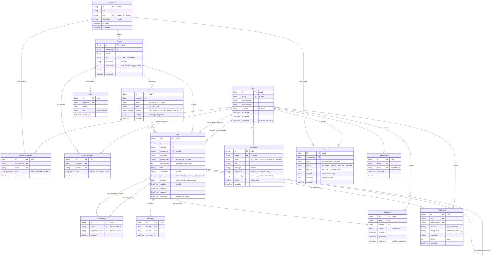

# HiveTech Database Schema

## Entity-Relationship Diagram



---

## Model Summaries

### User

The core identity model. Users authenticate with email and password, and can belong to multiple workspaces and projects with different roles.

| Field | Type | Notes |
|-------|------|-------|
| id | String (cuid2) | Primary key |
| email | String | Unique, used for login |
| passwordHash | String | bcrypt hash |
| displayName | String | Display name in the UI |
| avatarUrl | String? | Profile picture URL |
| createdAt | DateTime | Account creation time |
| updatedAt | DateTime | Last profile update |
| deletedAt | DateTime? | Soft delete timestamp |

### Workspace

Top-level organizational unit. All projects and data are scoped to a workspace, providing full multi-tenancy.

| Field | Type | Notes |
|-------|------|-------|
| id | String (cuid2) | Primary key |
| name | String | Workspace display name |
| slug | String | Unique, URL-friendly identifier |
| description | String? | Optional description |
| createdAt | DateTime | Creation time |
| updatedAt | DateTime | Last update |

### WorkspaceMember

Join table linking users to workspaces with role-based permissions.

| Field | Type | Notes |
|-------|------|-------|
| id | String (cuid2) | Primary key |
| workspaceId | String | FK to Workspace |
| userId | String | FK to User |
| role | WorkspaceRole | OWNER, ADMIN, or MEMBER |
| createdAt | DateTime | When user joined |

**Unique constraint**: `(workspaceId, userId)` -- a user can only be a member once per workspace.

### Project

A project lives within a workspace and contains tasks, statuses, and labels.

| Field | Type | Notes |
|-------|------|-------|
| id | String (cuid2) | Primary key |
| workspaceId | String | FK to Workspace |
| name | String | Project display name |
| key | String | Short prefix for task numbers (e.g., "HT") |
| description | String? | Optional description |
| taskCounter | Int | Auto-incrementing counter for task numbers |
| createdAt | DateTime | Creation time |
| updatedAt | DateTime | Last update |

**Unique constraint**: `(workspaceId, key)` -- project keys must be unique within a workspace.

### ProjectMember

Join table linking users to projects with role-based permissions.

| Field | Type | Notes |
|-------|------|-------|
| id | String (cuid2) | Primary key |
| projectId | String | FK to Project |
| userId | String | FK to User |
| role | ProjectRole | ADMIN, MEMBER, or VIEWER |
| createdAt | DateTime | When user was added |

**Unique constraint**: `(projectId, userId)`

### ProjectStatus

Custom statuses for a project's task workflow. Each status belongs to a category that drives business logic (e.g., "Done" category marks tasks as complete).

| Field | Type | Notes |
|-------|------|-------|
| id | String (cuid2) | Primary key |
| projectId | String | FK to Project |
| name | String | Display name (e.g., "In Review") |
| color | String | Hex color for the UI |
| category | StatusCategory | NOT_STARTED, ACTIVE, DONE, or CANCELLED |
| position | Float | Ordering within the project |
| createdAt | DateTime | Creation time |

### Task

The primary work item. Tasks belong to a project, have a status, and can be organized into hierarchies via subtasks.

| Field | Type | Notes |
|-------|------|-------|
| id | String (cuid2) | Primary key |
| projectId | String | FK to Project |
| statusId | String | FK to ProjectStatus |
| assigneeId | String? | FK to User (nullable) |
| reporterId | String | FK to User (the creator) |
| parentTaskId | String? | FK to Task (for subtasks) |
| taskNumber | Int | Sequential number within project |
| title | String | Task title |
| description | String? | Rich text description |
| priority | Priority | URGENT, HIGH, MEDIUM, LOW, or NONE |
| position | Float | Ordering within status column |
| dueDate | DateTime? | Optional deadline |
| createdAt | DateTime | Creation time |
| updatedAt | DateTime | Last modification |
| deletedAt | DateTime? | Soft delete timestamp |

### TaskDependency

Tracks "blocked by" relationships between tasks.

| Field | Type | Notes |
|-------|------|-------|
| id | String (cuid2) | Primary key |
| taskId | String | FK to Task (the blocked task) |
| dependsOnTaskId | String | FK to Task (the blocking task) |
| createdAt | DateTime | When dependency was created |

**Unique constraint**: `(taskId, dependsOnTaskId)` -- prevents duplicate dependencies.

### Label

Project-scoped labels for categorizing tasks (e.g., "Bug", "Feature", "Documentation").

| Field | Type | Notes |
|-------|------|-------|
| id | String (cuid2) | Primary key |
| projectId | String | FK to Project |
| name | String | Label text |
| color | String | Hex color for the UI |
| createdAt | DateTime | Creation time |

### TaskLabel

Join table for the many-to-many relationship between tasks and labels.

| Field | Type | Notes |
|-------|------|-------|
| id | String (cuid2) | Primary key |
| taskId | String | FK to Task |
| labelId | String | FK to Label |
| createdAt | DateTime | When label was applied |

**Unique constraint**: `(taskId, labelId)`

### Comment

Text comments on tasks. Supports soft deletion.

| Field | Type | Notes |
|-------|------|-------|
| id | String (cuid2) | Primary key |
| taskId | String | FK to Task |
| authorId | String | FK to User |
| content | String | Comment text |
| createdAt | DateTime | When posted |
| updatedAt | DateTime | Last edit time |
| deletedAt | DateTime? | Soft delete timestamp |

### Attachment

File attachments on tasks. Stores metadata in the database with actual files on disk.

| Field | Type | Notes |
|-------|------|-------|
| id | String (cuid2) | Primary key |
| taskId | String | FK to Task |
| uploadedById | String | FK to User |
| filename | String | Original filename |
| storagePath | String | Disk path or S3 key |
| mimeType | String | File MIME type |
| fileSize | Int | File size in bytes |
| createdAt | DateTime | Upload time |

### Notification

User notifications triggered by system events (task assignment, new comments, etc.).

| Field | Type | Notes |
|-------|------|-------|
| id | String (cuid2) | Primary key |
| userId | String | FK to User (recipient) |
| type | String | Event type (e.g., "TASK_ASSIGNED") |
| title | String | Notification title |
| message | String? | Optional detail message |
| resourceId | String? | ID of related entity |
| resourceType | String? | Type of related entity |
| isRead | Boolean | Whether user has read it |
| createdAt | DateTime | When notification was created |

### ActivityLog

Audit trail that records all significant actions within a workspace.

| Field | Type | Notes |
|-------|------|-------|
| id | String (cuid2) | Primary key |
| workspaceId | String | FK to Workspace |
| userId | String | FK to User (who did it) |
| action | String | Action type (e.g., "TASK_CREATED") |
| entityType | String | What was affected (e.g., "Task") |
| entityId | String | ID of affected entity |
| metadata | Json | Before/after state, flexible structure |
| createdAt | DateTime | When the action occurred |

### RefreshToken

Stores active refresh tokens for session management and revocation.

| Field | Type | Notes |
|-------|------|-------|
| id | String (cuid2) | Primary key |
| userId | String | FK to User |
| token | String | Unique hashed token value |
| expiresAt | DateTime | Token expiration time |
| createdAt | DateTime | When token was issued |

---

## Enums

### WorkspaceRole

```
OWNER    -- Full workspace control, can delete workspace
ADMIN    -- Manage members and projects
MEMBER   -- Create and work on tasks
```

### ProjectRole

```
ADMIN    -- Manage project settings, statuses, and members
MEMBER   -- Create and modify tasks
VIEWER   -- Read-only access
```

### Priority

```
URGENT   -- Immediate attention required
HIGH     -- Important, should be done soon
MEDIUM   -- Normal priority
LOW      -- Can wait
NONE     -- No priority set
```

### StatusCategory

```
NOT_STARTED  -- Work has not begun (e.g., "Backlog", "To Do")
ACTIVE       -- Work is in progress (e.g., "In Progress", "In Review")
DONE         -- Work is complete (e.g., "Done", "Merged")
CANCELLED    -- Work was abandoned (e.g., "Cancelled", "Won't Fix")
```

---

## Relationships Summary

| Parent | Child | Relationship | FK Column |
|--------|-------|-------------|-----------|
| User | WorkspaceMember | 1:N | userId |
| User | ProjectMember | 1:N | userId |
| User | Task (assignee) | 1:N | assigneeId |
| User | Task (reporter) | 1:N | reporterId |
| User | Comment | 1:N | authorId |
| User | Attachment | 1:N | uploadedById |
| User | Notification | 1:N | userId |
| User | ActivityLog | 1:N | userId |
| User | RefreshToken | 1:N | userId |
| Workspace | WorkspaceMember | 1:N | workspaceId |
| Workspace | Project | 1:N | workspaceId |
| Workspace | ActivityLog | 1:N | workspaceId |
| Project | ProjectMember | 1:N | projectId |
| Project | ProjectStatus | 1:N | projectId |
| Project | Task | 1:N | projectId |
| Project | Label | 1:N | projectId |
| ProjectStatus | Task | 1:N | statusId |
| Task | TaskDependency (blocked) | 1:N | taskId |
| Task | TaskDependency (blocks) | 1:N | dependsOnTaskId |
| Task | TaskLabel | 1:N | taskId |
| Task | Comment | 1:N | taskId |
| Task | Attachment | 1:N | taskId |
| Task | Task (subtasks) | 1:N | parentTaskId |
| Label | TaskLabel | 1:N | labelId |

---

## Design Decisions

### 1. CUID2 Primary Keys

All models use CUID2 for primary keys instead of auto-incrementing integers or UUIDs.

**Rationale**:
- URL-safe: no special characters, can be used directly in URLs
- Collision-resistant: cryptographically random with monotonic prefix
- No sequential information leakage: attackers cannot enumerate resources
- Shorter than UUID: 25 characters vs 36 characters
- Sortable: monotonic prefix allows reasonable insertion ordering

### 2. Float-Based Position Ordering

Tasks within a status column and statuses within a project use `Float` values for their `position` field rather than sequential integers.

**Rationale**:
- Inserting between two items is a simple calculation: `position = (prev + next) / 2`
- No need to shift or re-number other rows on insert or reorder
- Drag-and-drop reordering only updates a single row
- Periodic rebalancing is performed when float precision degrades (many insertions between the same pair of items)

**Example**:
```
Status A: position = 1.0
Status B: position = 2.0
Insert C between A and B: position = 1.5
Insert D between A and C: position = 1.25
```

### 3. Soft Deletes

User, Task, and Comment models implement soft deletes via a nullable `deletedAt` column.

**Rationale**:
- Preserves referential integrity: other records referencing a soft-deleted row remain valid
- Allows recovery: accidentally deleted items can be restored
- Audit compliance: maintains a complete history of data
- All queries must filter `WHERE deletedAt IS NULL` to exclude deleted records (enforced via Prisma middleware or default query scopes)

### 4. StatusCategory Enum

Instead of hardcoding status names (e.g., "To Do", "Done"), each `ProjectStatus` has a `category` field mapped to the `StatusCategory` enum.

**Rationale**:
- Allows custom status names: teams can name statuses whatever they want ("In Review", "QA", "Deployed")
- Business logic uses categories, not names: completion logic checks for `category = DONE`, not `name = "Done"`
- Consistent behavior: a task with any status in the `DONE` category is considered complete
- Extensible: new categories can be added without breaking existing status names

### 5. Task Numbering

Each project maintains a `taskCounter` field that increments atomically. Tasks receive a sequential `taskNumber` within their project.

**Rationale**:
- Human-friendly identifiers: "HT-42" is easier to reference than a CUID
- Per-project numbering: each project starts from 1
- Atomic increment: uses database-level atomic operations to prevent duplicates
- The `taskNumber` combined with the project `key` forms the display identifier (e.g., HT-1, HT-2)

### 6. Workspace Isolation (Multi-Tenancy)

All data flows through workspaces. Projects belong to workspaces, tasks belong to projects, and all other entities are reachable through this hierarchy.

**Rationale**:
- Complete data isolation between organizations
- Simplified authorization: check workspace membership first, then project membership
- Clean data model: no cross-workspace references possible at the schema level
- Enables future per-workspace features: billing, quotas, custom settings

### 7. JSON Metadata on ActivityLog

The `ActivityLog` model uses a JSON column for `metadata` instead of a structured set of before/after columns.

**Rationale**:
- Flexible: can store different shapes of data for different action types
- No schema changes needed when adding new tracked actions
- Stores before/after state for change tracking without additional tables
- Example metadata for a status change:
  ```json
  {
    "before": { "statusId": "abc123", "statusName": "To Do" },
    "after": { "statusId": "def456", "statusName": "In Progress" }
  }
  ```

---

## Indexes

Key indexes for query performance:

| Model | Columns | Purpose |
|-------|---------|---------|
| User | email | Login lookups |
| Workspace | slug | URL-based workspace lookups |
| WorkspaceMember | (workspaceId, userId) | Unique constraint + membership checks |
| ProjectMember | (projectId, userId) | Unique constraint + membership checks |
| Task | projectId, statusId | Listing tasks by project and status |
| Task | assigneeId | Listing tasks assigned to a user |
| Task | parentTaskId | Listing subtasks |
| Task | (projectId, taskNumber) | Looking up task by display number |
| TaskDependency | (taskId, dependsOnTaskId) | Unique constraint |
| TaskLabel | (taskId, labelId) | Unique constraint |
| Comment | taskId | Listing comments on a task |
| Attachment | taskId | Listing attachments on a task |
| Notification | (userId, isRead) | Unread notification count and listing |
| ActivityLog | (workspaceId, createdAt) | Workspace activity feed |
| RefreshToken | token | Token lookup during refresh |
| RefreshToken | userId | Listing/revoking user sessions |
